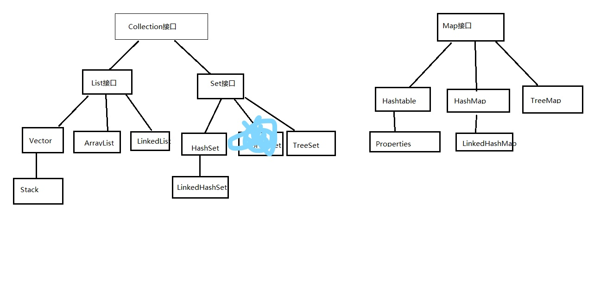

### 静态变量和非静态的属性:
	1. 值的存储位置不同
		非静态的属性:堆
		静态变量:方法区
	2. 值的初始化(赋值)的时机不同
		非静态属性:创建实例对象时,在<init>()实例初始化方法中完成初始化;
		静态变量: 类初始化时,在<clinti>()类初始化方法中完成初始化;
		静态变量比分静态的要早
	3. 非静态的属性:每一个对象时独立的,各自存一份;
		静态变量:所有该类的对象共享一份;
	4. 生命周期
		非静态的属性:随着对象的创建而存在,当对象被垃圾回收器回收就消失;
		静态变量:随着类的初始化而初始化,随着类的卸载而卸载;
	5. get/set不同:
		非静态的属性:对应get/set也是非静态的,如果局部变量与属性重名了,用"this."区别
		静态变量:对应get/set也是静态的,如果局部变量与属性重名了,用"类名."区别
		
### static修饰方法
	static修饰方法,成为静态方法,类方法
	(1)可以通过"类名."调用,可以不通过"对象."调用,当然也可以通过"对象."调用
	(2) 静态方法中是不可以出现this,super这些关键字的
	(3) 静态方法中不能直接使用本类的非静态的成员(属性,方法,内部类))
### static修饰代码块
	代码块的作用:为属性初始化
	代码块分为非静态代码块和静态代码块
	非静态代码块的作用:为非静态的属性初始化,
	静态代码块的作用:为静态的属性
### final修饰符:
	可以修饰:(1)类:包括内部类和外部类
				(2)方法
				(3)变量:包括属性和局部变量
	1,final修饰类:
	表示这个类不能被继承,是个太监类,没有子类
	2,final修饰方法:
	表示这个方法可以被子类继承,但是不能被子类重写
	3,final修饰变量
	表示它是一个常量,值不能被修改(注:常量名建议大些)
  ### native:原生的,内置的
 	 只能修饰方法
  ### 修饰符
  
  

   ### abstract :抽象的
  	 它只能修饰:类和方法
	1. 为什么要使用抽象类和抽象方法
	当我们在设计父类时,发现某些方法是无法给出具体的实现,具体的实现应该在子类中实现.那么这样的方法,在父类中就可以设计为"抽象方法".
	注意:包含抽象方法的类,必须是一个"抽象类"
			抽象类不能直接new对象;
			抽象类就是用来被继承的,那么子类继承抽象类后,必须实现抽象类的抽象方法;

## 接口:
		代表一种标准;
		(1),接口是没有构造器,代码块,属性(除:全局,静态,的常量);
		(2),public static final 常量名;
			public abstract 方法名;
			public static  方法名;
			public default 方法名; 
## eclipse快捷键:
		Ctrl+1:快速修复;
		shift+alt+s:自动生成构造器框;
		同时按ctrl+2,在按L:自动生成变量名声明
		Ctrl+shift+t:打开Open type;
		ctrl+d:删除当前行;
		
## 内部类:
		1,分为:
		    成员内部类(在类中,方法外) 
		     局部内部类(在方法内)
## 枚举:
		代表这样一系列的类型,这些类型有一个非常明显的特征:他们的对象是有限的几个.
## 注解:
		(1),声明注解,定义注解:
				我们开发中,绝大多数都是别人定义好的.
		(2),使用注解(重要)
				我们开发中主要是这步
		(3),读取注解的信息
				*我们把读取注解信息的代码"注解信息处理流程",如果没有(3)前面两部都没有意义
				*读取注解的信息的代码都是别人写好的
				*读取注解的代码需要"反射"的知识
		系统注解:
				*@Override:重写
				*@SuppressWarnings(xxx):抑制警告
				*@Deprecated:告知编译器和程序员这个方法,属性,类已过时
## java中的注释:
		(1),单行注释
		(2),多行注释
		(3),文档注释,Java特有,需要配合注解使用
		
## JAVA编码对应字节
		(1),UTF-8:一个汉字3个字节;
		(2),GBK:一个汉字2字节;				
## 为什么要有包装类
		因为java的某些特性和API,例如泛型和集合,不支持基本数据类型,所有必须把基本数据类型转为包装类的对象.
		byte->Byte
		short->Short
		int ->Interger
		long->Long
		char->Character
		float->Float
		double->Double
		boolean->Boolean
## 基本数据类型和包装类的转换
		装箱:
			Interger i = new Integer(10)//手动装箱
			Integer i = 10;//自动装箱
		拆箱:
			Integer i = new Integer(10);
			int a = i.intValue();//手动拆箱
			int a = i;//自动拆箱
## 把字符串转为基本数据类型
		String str = "123"
		int i = Integer.parseInt(str);
		int i = Integer.valueOf(str);
## 把基本数据类型转化成字符串
		int	a = 10;
		String str = a+"";
		String str = String.valueOf(a);
## String StringBuffer StringBuilder
			(1)String:是不可变的
			(2)StringBuffer:是可变的,这个拼接不能用+,要用append
			(3)StringBuilder和StringBuffer的API完全兼容;
				当多线程共同使用同一个StringBuffer的对象时,是安全的,
				当多线程共同使用同一个StringBuilder的对象时,是不安全的;
			(4)单线程情况下,建议使用StringBuilder.		 
## 日期
		第一代:java.util.Date(注:时间是1900年开始的)
		第二代:java.util.Calendar(注:时间是1970年开始的)
		第三代:JDK1.8之后引入了新的日期时间API,例如:LocalDate,LocalTime等
			(1)老版的日期时间对象没有设计为不可变对象
		目前常用:
			第一代:java.util.Date
				1,new Date() //日期
				2,long getTime() //毫秒
				3,new Date(毫秒) //把毫秒转成日期
			第二代:java.util.Calendar 抽象类
				子类:GregorianCalendar
		关于日期格式化和解析:
			java.text.DateFormat;(抽象类)
			java.text.SimpleDateFormat;(子类)
				1,Date parse(str) 把字符串转化成日期
				2,String format(date) 把日期转化成字符串
				
					
##随机数
		(1),Math.random() //范围:[0,1)
		(2),java.util.Random专门产生随机数:
		
## List常见的实现类
		(1) vector:动态数组        (注:旧版,线程安全的,初始化大小为10,支持迭代的方式更多,支持旧版Enumeration迭代器;
		(2) ArrayList 动态数组(注:新版,线程不安全,初始化大小为10,不支持旧版Enumeration迭代器;	
		(3) 	LinkedList:双向链表,双端队列
		(4) Stack:栈,又是Vector的子类,(FILO:first in last out)
		(5) 队列:先进先出
		(6) 双端队列:对头和对尾都可以添加元素和移除元素
## Set接口,是Collection的子接口
		(1),不支持重复
		(2),无序的(和添加顺序无关)	
		Set:
			(1),HashSet;完全无序,
				依据元素的equals方法保证两个元素不重复;
			(2),TreeSet:大小顺序,
				和添加顺序无关;依据元素的'大小'顺序保证元素不重复;
			(3),LinkedHashSet:遍历时可以保证添加顺序,存储和添加无关;
				和HashSet一样,依据元素的equals方法保证两个元素不重复;
## List Set Map总结
 	 		
		

## 泛型
	类型形参
	(1),泛型类,泛型接口
	(2),泛型方法
		      例:Map<K,V>
			 ArrayList<E>
			 BiFunction<T,U,R>
			 Comparator<T>
		       泛型形参一般都是一个大写字母
		  T:Type
		  K:Key
		  V:value
		  E:Element
		  R:返回值类型
		  U: 因为T用过了,那么换个字母	 
	(3)泛型实参必须时数据类型,不能时基本数据类型
	(4)不支持基本数据类型的问题
		4.1集合
		4.2泛型
		等不支持基本数据类型
## IO流
		最基本的四个抽象类:
		 (1),InputStream   字节输入流
		 (2),OutputStream  字节输出流
		 (3),Reader 		 字符输入流
		 (4),Writer		字符输出流
		注:字节流:适用于所有类型的数据
		       字符流:仅仅能用于处理纯文本的数据(.txt,.java,.css,等等)
		 按IO流的角色分:
		 	节点流:像文件流
		 	处理流:像缓存流,编码与解码IO流,序列化与反序列化等
		 		     处理流是在其他流(包括节点流和处理流)的基础上增加功能用的,依赖于节点流
		
## 常用IO流操作
	FileInputStream:当要从文件读取内容,以字节的方式读取,那么可以选择这个IO流;
	FileOutputStream:当要把数据写到文件中,并且数据是字节数据,那么可以选择这个IO流;
	FileReader:当要从文件读取内容,以字符的方式读取,那么可以选择这个IO流;
			(注意:FileReader是只能按照平台默认的字符编码方式数据进行解码读取)
	FileWriter:当要把数据写到文件中,并且数据是字符数据,那么可以选择这个IO流
			(注:FileWriter是只能按照平台默认的字符编码方式进行编码写出)
	
	
	BufferedInputStream:给InputStream系列的IO流添加缓冲功能,或者说可以包装InputStream系列的IO流.
	BufferedOutputStream:给ouputStream系列的IO流添加缓冲功能,或者说可以包装OuputStream系列的IO流.
	BufferedReader:给Reader系列的IO流增加缓冲功能,或者说可以包装Reader系列的IO流;
	BufferedWriter:给Writer系列的IO流增加缓冲功能,或者说可以包装Writer系列的IO流;
	
	InputStreamReader:解码
			当要把一个字节流数据,按照指定的字符编码方式进行解码,转为字符流读取.
			即InputStreamReader可以包装以个字节输入流InputStream,然后包装完后,从InputStreamReader的流对象中读取就是字符流;
	OutputStreamWriter:编码
			当要把一个字符流的数据,按照指定的字符编码方式,进行编码,转为字节流输出时.
			
## 程序,进程,线程
	程序(program):
		为了完成某个任务,完成某个功能而选择编程语言(例如:C语言,Java语言,Python等)编写的一组指令的集合.
	进程(Process):
		程序的一次运行.
		进程是操作系统分配资源的最小单位,同一个进程是共享同一份内存等资源,不同的进程之间是不共享内存资源.
		如果两个进程之间进行数据交换,比较复杂,可以通过"文件",网络通信等方式,成本高.
	线程(Thread):
		(1)当某个进程需要同时完成多个功能时,那么可以采用多线程.
		(2)线程时CPU调度资源的最小单位.
		(3)多个线程之间有共享内存,
		注:
			堆:对象					   -->>实例变量,线程时共享的
			方法区:类的信息,常量,静态等  -->>常量,静态变量线程时共享的
			栈:局部变量					-->>局部变量每个线程时独立的
	Java要如何开启main以外的线程:
		(1)继承Thread类
		(2)实现Runnable接口
		(3)....
	线程的生命周期:
		新建-->就绪-->运行-->死亡
	
	多线程并行和并发的区别:
		(1)并行就是两个任务同时运行,就是加任务进行的同时,乙任务也在进行,(需要多核CPU)
		(2)并发是指两个任务都请求运行,而处理器只能接受一个任务,就把这两个任务安排轮流进行,由于时间间隔比较短,使人感觉两个任务都在进行;
	同步代码块和同步方法:
		同步代码块:
			synchronized(锁对象){
				需要锁起来的代码
			}

		同步方法:
			非静态方法:默认为锁对象为this;
			静态方法:默认锁对象为该类的字节码,例:String.class
## 单例设计模式
	(1)保证类在内存中中有一个对象;
	(2)单例设计模式实现方式步骤:
			2.1声明一个类,类中有一个属性类型与类名相同;
			2.2把构造方法声明为私有
			2.3在类中提供一个公共访问方法来返回该对象实例
	(3)单例具体代码实现:      	
```
//方式一:饿汉式(上来就new)(线程安全)
class Singleton{
	private static Singleton instance=new Singleton();
	private Singleton() {};
	public static Singleton getInstance(){
		return instance;
	};
}
//方式二:懒汉式(用的时候在new)(线程不安全)
class Singleton{
	private static Singleton instance;
	private Singleton() {};
	public static Singleton getInstance(){
		if (instance == null){
			instance = new Singleton();
		}
		return instance;
	};
}
//方式三:再简单
class Singleton{
	public static final Singleton instance= new Singleton();
	private Singleton() {};
}

```
## lambda表达式
	(1)只有函数式接口才能用Lambda表达式
	(2)Lambda作用就是简化代码,使得代码更整洁			
			注:函数式接口:SAM(Single Abstract Method)只有一个抽象方法的接口,当然这个接口可以有默认方法和静态方法等成员.
	(3)哪些属于SAM接口:
			java.lang.Runnable:public void run()
			java.lang.Comparable(T):public int compareTo(T t)
			java.util.Comparator(T):public int compare(T t1,T t2)
			java.lang.Iterable:public Iterator iterator()
## Optional 
	JDK1.8新增java.lang.Optional 可以看成是一个迷你型的容器,用来装一个对象的容器
	因为java语言有一个异常经常被诟病,NullPionterException
				
## 数据库
	(1)DDL
		对数据库操作
		1.1 show databases;
		1.2 create database 数据库名;
		1.3 drop database 数据库名;
		1.4 use 数据库名;
		对表格操作
		1.1 show tables;或show tables from 数据库名;
	(2)DML
	(3)DCL	
## JDBC
	
			
			
			
			
			
			
			
			
			
			
			
			
						 	
		


		  
		     
		     
		     
		     