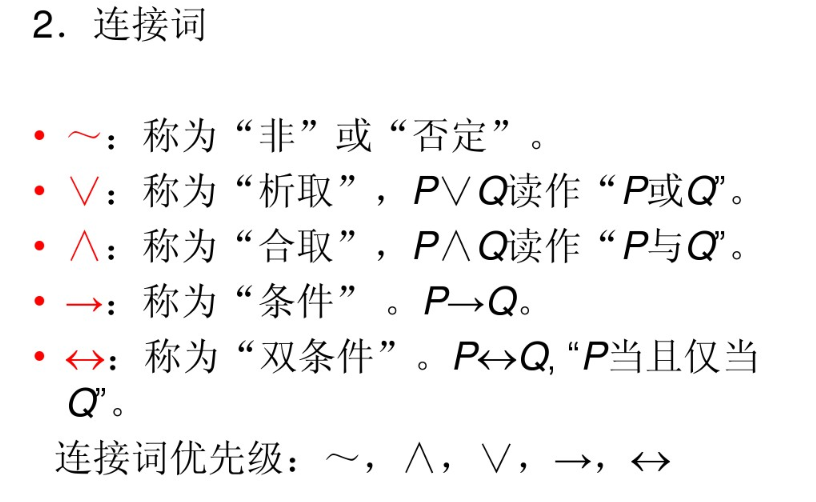

# 前言
		(1),1977年斯坦福大学教授爱德华.费根鲍姆,提示"知识工程"的概念,随后兴起一系列知识表示,构建和应用的理论和方法;(主要是人工构建,知识工程的发展遇到了瓶颈)
		(2),2012年5月,谷歌发布新一代"搜索引擎"(可以展示与关键词所描述的实体和概念相关的人物,地点和时间等),给予wikipedia构建的通用知识图谱,提出知识图谱的概念;
		(3),微软probase,百度知心,搜狗知立方;
### 什么知识图谱
		(1),知识:人类的认识成果,来自社会实践,其初级形态是经验知识,高级形态是系统科学知识;
			1,陈述性知识(描述性知识):描述事物客观的静态信息,主要分为,事物,概念,命题三个层次;
				1.1,事物指特定的事和物;
				1.2,概念是对一类事物本质特性的放映;
				1.3,命题是对事物之间关系的陈述;
			2,过程性知识(程序性知识):描述问题如何求解的动态信息;
				2,1,规则:描述事物的因果关系;
				2.2,控制结构:描述问题的求解步骤;
		(2):知识是认知,图谱是载体,数据库(neo4j,jena)是实现,知识图谱就是在数据库系统上利用图谱这种抽象载体表示知识这种认知内容;
		(3),构建知识图谱,从人工->群体智能->面向互联网自动获取;
		(4),知识图谱分类:
			4.1:语言知识图谱(wordNet)(近义词,同义词等等)
			4.2:常识知识图谱(opencyc)
			4.3:领域知识图谱(IMDB)电影
			4.4:百科知识图谱(wikidata)
			4.5:语言认知知识图谱(HowNet)(对词汇进行描述
### 知识图谱的生命周期
		(1),知识体系构建(知识建模)
				是指采用什么样的方式表达知识,其核心是构建一个本体对目标知识经行描述(本体不包含具体实例);
		(2),知识获取
				2.1,结构化数据:提供高质量的三元组,是构建知识图谱的核心;
				2.2,半结构化数据;
				2.3,非结构化数据:
					信息抽取包含:实体识别
							      实体消歧:(分为实体链接,实体聚类)
							      关系抽取:(分为:关系分类,属性抽取,关系实例抽取)
							      事件抽取;
	    (3),知识融合
	    			是对不同来源,不同语言,不同结构的知识进行融合,从而对已有知识图谱进行补充,更新,去重;
	    			分为:3.1知识体系的融合:相同的类别,属性,关系经行映射;
	    				3.2实例的融合:实体实例融合,关系实例融合;
	    	(4),知识存储
	    			目前大多都是基于图的数据结构
	    			4.1:rdf格式(apache,Jena)
	    			4.2:图数据库(neo4j)
	    	(5),知识推理
	    			用途:5.1:挖掘实体隐含语义关系,进而可以补全知识图谱;
      				5.2:直接可以应用在任务上,如自动问答系统;
      	(6),知识应用
      			智能搜索
      			自动问答
      			推荐
      	(注:Bengio在<<deep learning>>称,平均每个类别需要5000个标注才能达到理想的性能;
      	总结:1,知识图谱本身是一种语义网络,但是相较与传统的知识表示,现有的知识图谱以三元组为统一表示形式;目前只能表示事实性知识,其他比如(程序化知识,概念性知识)则不能;
      		2,趋势:在深度学习方法中融合知识图谱
      			     在知识图谱中应用深度学习 	
# 知识表示
##### 经典知识表示理论
		(1),命题逻辑
			与(∧),或(∨),非(﹁),蕴含(→),当且仅当() 注:非(﹁)优先级最高
 
	
		(2)一阶谓词逻辑
			在命题逻辑的基础上引入了全称量词(∀)和存在量词(ヨ)
		(3),语义网络
			(1)是奎利恩在1966年,在研究人类的联想记忆时提出的一种心理学模型:认为人类的记忆是有概念间的联系实现的,他用此做知识表示
			(2)语义网路中最基本的语义单元称语义基元,可以有三元组表示<节点1,关系,节点2>
			(3)语义网络中关系的类型:
				3.1 实例关系(ISA)
				3.2分类关系(AKO  a kind of的缩写)
				3.3成员关系(a-member-of)
				3.4属性关系
				3.5聚合关系
				3.6时间关系
				3.7位置关系
				3.8相近关系
			 重点:语义网络和一阶谓词对比:
			 	他们具有相同的表达能力,但语义网络用最简单的统一形式描述所有知识,非常有利于计算机的存储和检索;
			 	语义网络没有像一阶谓词那样明了的推理机制,需要针对不同的关系做不同的处理,推理方法不完善
		 (4)框架
		 	 从认知学的角度,框架继承了人类认识世界的方式,对事和物,人类都是以一种类似于框架的结构存储在记忆中的
		 (5),脚本
##### 语义网中的知识表示方法
		前言:语义网=web3.0
		(1),xml(可扩展标记语言),语义表达语言
		(2),rdf(资源描述框架)可以说是xml的简化或扩展
		(3),owl(网络本体语言)建立在rdf,和rdf schame上的
		
##### 知识图谱中的知识表示方法
		前言:一个知识本体涵盖:(1,事物  2,概念  3,属性 4,关系) 5,函数  6.约束  7,规则 8 公理 			
		            目前大部分知识图谱主要对前四部分内容经行建模,很少有知识图谱建模了简单的规则结构,这反映了不同的层次知识在表示上的复杂程度是不同的
		注:知识图谱放宽了对三元组中各项值的要求,并不局限于实体,也可以是数值.文字等其他类型的数据;    
		(1)Freebase中的知识框架
				Freebase不局限于三元组原子知识表示,它创造了一个虚拟的节点结构,被称为组合值类型(compound value type  CVT)试图对多元关系表示
				例如: <中国, 人口信息,e1>
						<el,人口数量,1332810869@int>.
						<e1,时间,"2010年"@date>.
						<e1,名称,"第六次全国人口普查">.
					<中国, 人口信息,e2>
						<e2,人口数量,124261@int>.
						<e2,时间,"2000年"@date>.
						<e2,名称,"第五次全国人口普查">.	
		小结:知识图谱的真正魅力则在于它的图结构,这样可以在KG上进行搜索,随机游走,网络流等大规模的图算法,使得知识图谱与图论,概率图等碰撞出火花.
			例:1,基于大规模KG的逻辑规则的挖掘,得益于知识图谱中频繁子图的挖掘,促进了逻辑规则的自动生成和评价;
		       2,基于大规模链接图谱的标签传播,可以对知识图谱中的实体按照普通角度分类,也可以有目的的发现关键实体.		
##### 知识图谱的数值化表示方法
		前言:知识表示一大重要目标就是进行语义计算(从句子中识别出概念短语"中科院自动化所"并判断它是一个机构名,还有识别和预测"中国"和"北京"的关系都涉及语义计算),知识表示方法用符号表示概念以及关系,概念和关系的类型都是人们总结的结果,难免存在遗漏,例如:DBPedia中对人物没有定义"性别"属性;Freebase中对人物没有定义"朋友","爷爷"等关系,因此在语义计算中,不能仅仅依赖显式的知识表达;也要去做数值化表示;
		表示学习:也是知识图谱研究的热点任务之一,它是把KG中离散符号(实体,属性,关系,值等)用连续型数值进行表示;
		表示学习分为:
			(1),张量分解模型:
				核心思想是:
			(2),基于能量函数的模型:		
				该类方法克服了张量分解法在大规模KG表示学习中学习效率低的问题,
				
				
				
				
				
				
				
				
			
			    			
	    			
	    			
	    			
	    			
	    			
	    			
	    			
	    			
	    			
	    			
	    			
	    			
	    			
	    			
	    			
	    			
	    			
	    			
	    			
	    			
					